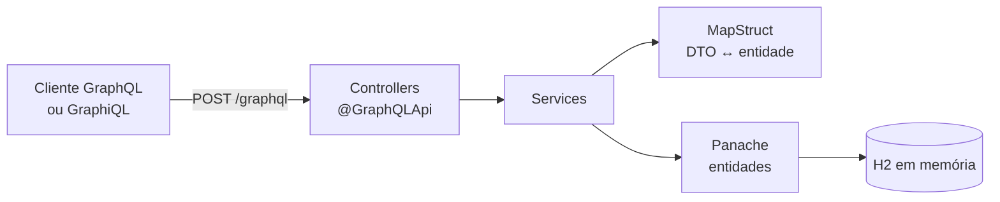
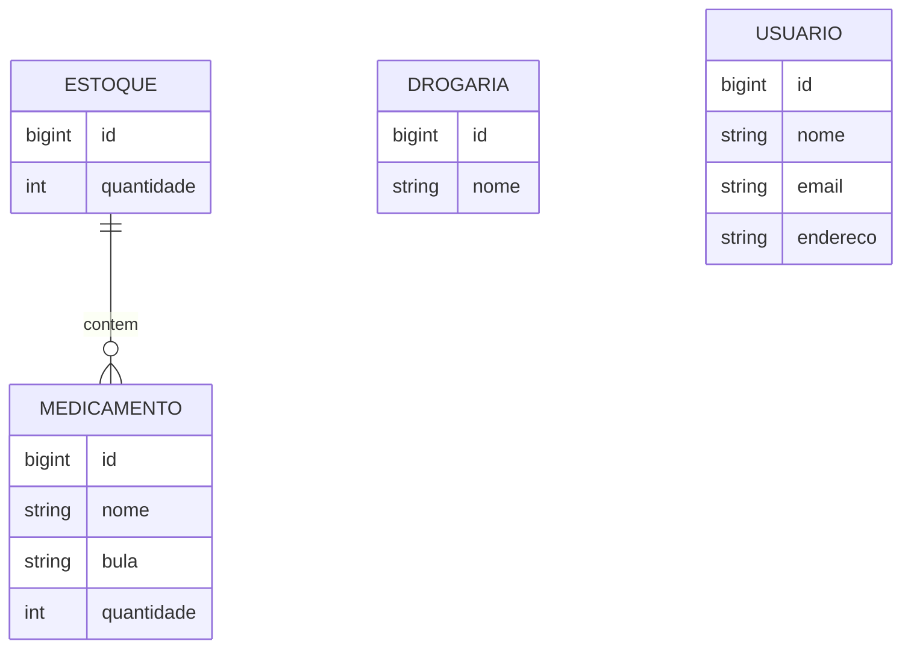

<div align="center">

# quarkus-graphql

**API GraphQL de uma drogaria, escrita com Quarkus e SmallRye GraphQL.**

[](https://openjdk.org/)
[](https://quarkus.io/)
[](https://smallrye.io/smallrye-graphql/)
[](https://quarkus.io/guides/hibernate-orm-panache)
[](https://maven.apache.org/)

[Sobre](#sobre) · [Como rodar](#como-rodar) · [Exemplos](#exemplos-de-consulta) · [Estrutura](#estrutura)

</div>

## Sobre

Projeto de estudo para explorar GraphQL no ecossistema Quarkus. O domínio é uma drogaria com medicamentos em estoque, pequeno o bastante para o foco ficar na API.

O exemplo cobre:

- Queries e mutations declaradas com as anotações do MicroProfile GraphQL (`@GraphQLApi`, `@Query`, `@Mutation`, `@Description`).
- Persistência com Hibernate ORM Panache em H2 em memória, com carga inicial por `import.sql`.
- Conversão entre entidades e DTOs com MapStruct, e Lombok para getters e setters.
- Testes com `@QuarkusTest` e JUnit 5.
- Dockerfiles gerados pelo Quarkus para JVM e para executável nativo (GraalVM).

## Arquitetura



Modelo de dados:



## Como rodar

Pré-requisito: JDK 11 ou superior.

```bash
git clone https://github.com/ronnyarruda20/quarkus-graphql.git
cd quarkus-graphql
./mvnw compile quarkus:dev      # ou: mvn compile quarkus:dev
```

Com a aplicação no ar:

| O quê | Onde |
|---|---|
| Endpoint GraphQL | `http://localhost:8080/graphql` |
| GraphiQL (só em dev mode) | <http://localhost:8080/q/graphql-ui> |
| Schema gerado | `http://localhost:8080/graphql/schema.graphql` |
| Dev UI do Quarkus | <http://localhost:8080/q/dev> |

O banco sobe vazio a cada execução e recebe a carga de `import.sql`: uma drogaria, um estoque e um medicamento.

## Exemplos de consulta

Listar drogarias:

```graphql
query {
  allDrogaria {
    id
    nome
  }
}
```

```json
{ "data": { "allDrogaria": [ { "id": 1, "nome": "Drogavida" } ] } }
```

Cadastrar uma drogaria:

```graphql
mutation {
  saveDrogaria(drogariaDTO: { nome: "Farmácia Central" })
}
```

A mutation devolve a mensagem `Salvo Com Sucesso`.

Listar estoques:

```graphql
query {
  allEstoque {
    id
    quantidade
  }
}
```

## Operações disponíveis

| Tipo | Nome | Descrição |
|---|---|---|
| Query | `allDrogaria` | Lista todas as drogarias |
| Query | `allEstoque` | Lista todos os estoques |
| Mutation | `saveDrogaria` | Cadastra uma drogaria |

As entidades `Medicamento` e `Usuario` têm serviço e testes, mas ainda não estão expostas na API.

## Testes

```bash
./mvnw test
```

## Build

```bash
./mvnw package                          # JAR em target/quarkus-app/
java -jar target/quarkus-app/quarkus-run.jar

./mvnw package -Pnative -Dquarkus.native.container-build=true   # executável nativo, sem GraalVM local
```

Imagens Docker: veja os Dockerfiles em `src/main/docker/`. O cabeçalho de cada um explica o build.

## Estrutura

```
src/main/java/org/graphql/modules/
├── controller/   queries e mutations GraphQL
├── dto/          objetos de entrada e saída
├── mapper/       mapeamentos MapStruct
├── model/        entidades Panache
└── service/      regras e acesso a dados
src/main/resources/
├── application.properties
├── import.sql                 carga inicial
└── db/migration/              migração Flyway (desligada; o schema vem do Hibernate)
```

---

<div align="center">
<sub>Feito por <a href="https://github.com/ronnyarruda20">Ronny Arruda</a> · <a href="https://ronnyarruda20.github.io">ronnyarruda20.github.io</a></sub>
</div>
